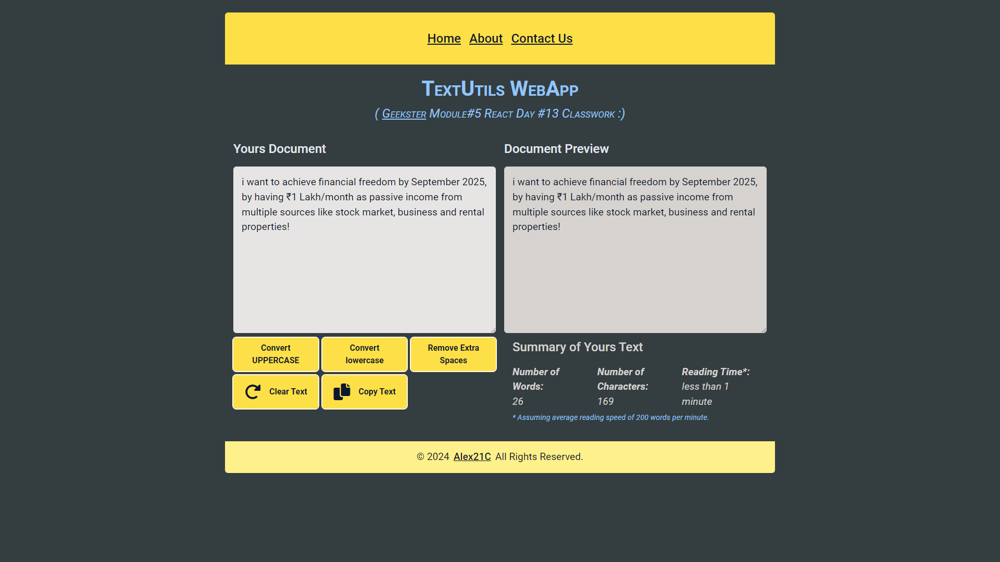

# Module#5 React Day #13 Classwork: TextUtils WebApp


## Hosted Version of the Project:
[m5react-day-13-classwork-textutils-webapp](https://m5react-day-13-classwork-textutils-webapp.vercel.app/)

## Project Overview:
In this project, i have created a robust Text Editor WebApp using ReactJS and state management with useReducer. A text editor is a versatile tool used for writing, formatting, and editing text content. By building a text editor with useReducer, we can efficiently manage complex state changes and implement various features that enhance the user's editing experience.

## Objectives
+ Developed a versatile Text Editor website using ReactJS.
+ Provide real-time feedback on text, including word count, character count, and reading time.
+ Enableed users to preview their document and apply text transformations (uppercase, lowercase).
+ Implemented a feature to clear text and remove extra spaces , copy To ClipBoard.

## How to install and run in yours local machine
```bash
npm install
npm run start
```

## Tech. Stack Used:
+ [React](https://react.dev/)
+ [TailwindCSS](https://tailwindcss.com/)
+ [Google Fonts](https://fonts.google.com/)
+ [Font Awesome](https://fontawesome.com/icons/)

## Author
[Abhishek kumar](https://www.linkedin.com/in/alex21c/), ([Geekster](https://geekster.in/) MERN Stack FS-14 Batch)


